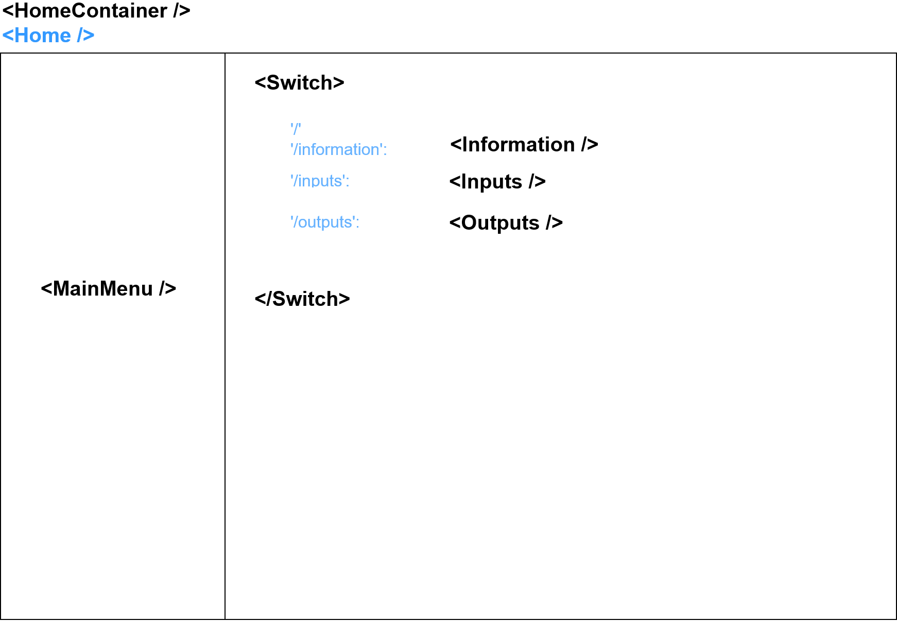
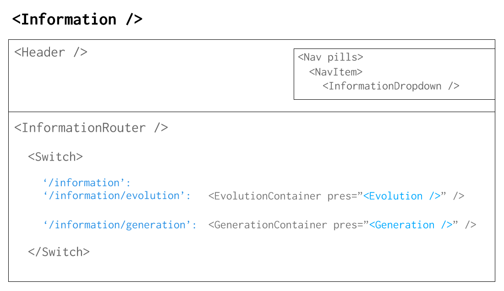
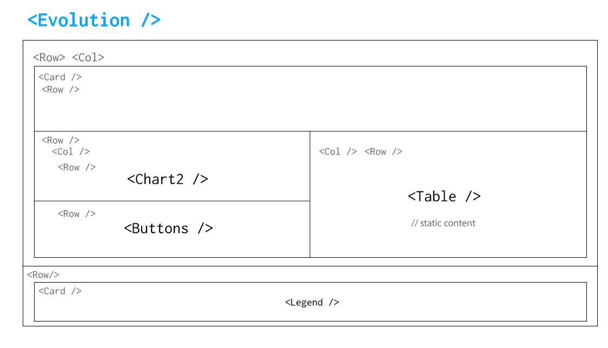
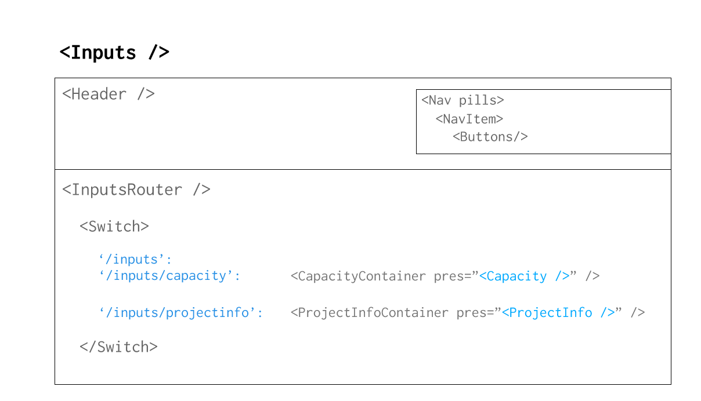
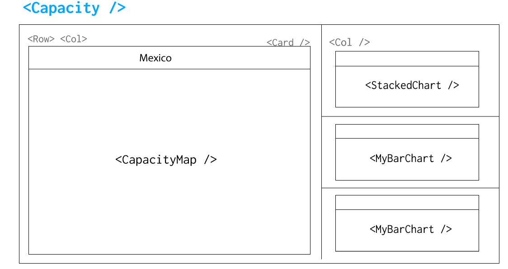
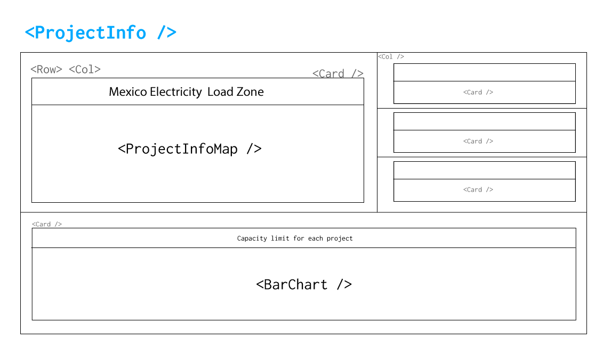
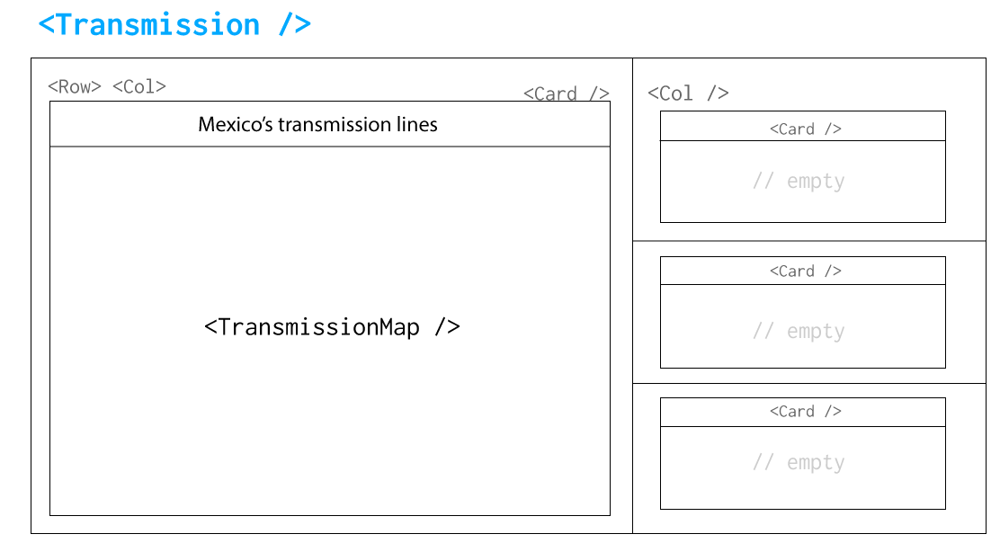

# SWITCH GUI Documentation

The SWITCH GUI is a mixture of several frameworks and libraries. At its core, it is a meteor application wrapped in an electron desktop app.

## Bootup Process

The bootup process is a bit complex from the fact that both meteor and electron have to be started. This is a video walkthrough of the code that boots the application:

<iframe width="100%" height="400" src="https://www.youtube.com/embed/e7QYGk9sH6s" frameborder="0" allow="encrypted-media" allowfullscreen></iframe>

## Architecture

## Some notes

- `recharts` is being used for the charts
- Redux is installed and developed but not used

## Missing data in PowerPlants.csv

The following load zones exist as a shape both in Prodesen and Switch, but no data exists for them in the `loadZones` collection under `powerPlants`

```
{6, 41, 45, 47, 49, 19, 20, 52, 26}
```


## Component Structure

The following is a sketch of the different component structure for the views of the application:








